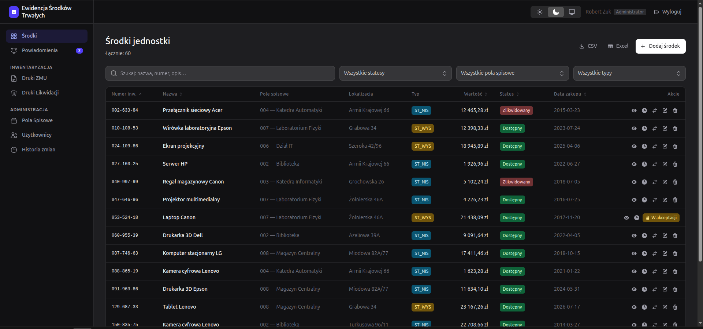
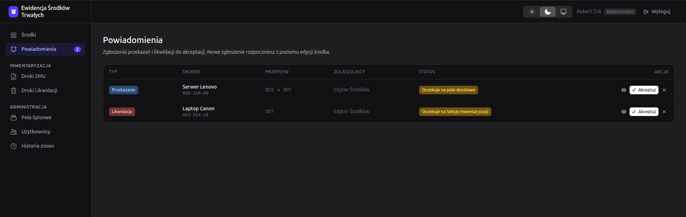
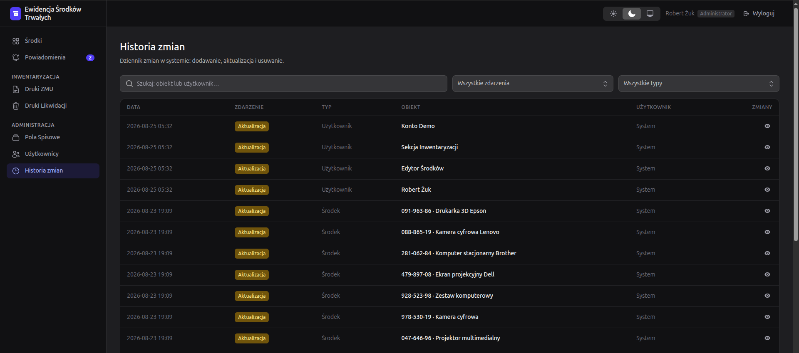
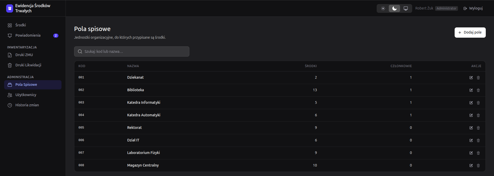
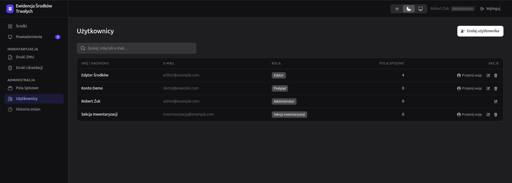
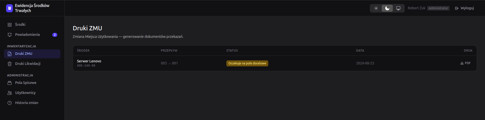
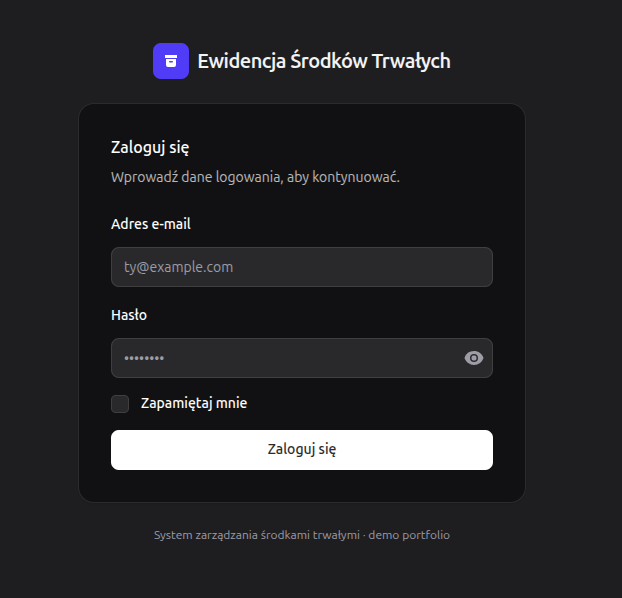

# Ewidencja Środków Trwałych

> System ewidencji środków trwałych z obiegiem wniosków dla instytucji — środki
> trwałe, pola spisowe, trzystopniowy obieg akceptacji transferu i likwidacji,
> historia zmian (audit trail), wydruki PDF oraz eksport CSV/Excel.

Zbudowany na **Laravel 13 · Livewire 4 · Volt · Flux · Tailwind v4**, testowany
**Pestem**, analizowany statycznie **Larastanem**, uruchamiany jednym
`docker compose up`.

> Domena to odtworzenie rzeczywistej aplikacji do zarządzania majątkiem; ta wersja
> to czysta, portfolio'wa reimplementacja ze znormalizowanym schematem, warstwą
> akcji/serwisów, autoryzacją opartą na politykach i pełnym pokryciem testami.
> Interfejs jest po polsku (język domeny); kod i commity po angielsku.

**🔗 Demo na żywo: [srodkitrwale.tojest.dev](https://srodkitrwale.tojest.dev)** — zaloguj się jako `demo@example.com` / `password` (konto tylko do odczytu).

[](https://github.com/robZuk/ewidencja-srodkow-trwalych/actions/workflows/ci.yml)
[](https://github.com/robZuk/ewidencja-srodkow-trwalych/actions/workflows/deploy.yml)

---

## Najważniejsze funkcje

- **CRUD środków** — lista z wyszukiwaniem, filtrami, sortowaniem i paginacją;
  formularz dodawania/edycji z walidacją po stronie serwera; historia zmian
  każdego środka.
- **Trzystopniowy obieg transferu** — edytor składa wniosek, pole docelowe
  akceptuje, sekcja inwentaryzacji potwierdza i środek zostaje przeniesiony —
  zamodelowane jako jawna maszyna stanów oparta na dedykowanych klasach akcji.
- **Obieg likwidacji** — wniosek → akceptacja inwentaryzacji → środek oznaczony
  jako zlikwidowany.
- **Historia zmian (audit trail)** — każda zmiana środka zapisywana przez obserwator
  (append-only), zamiast efektów ubocznych w `boot()` modelu ze starej wersji.
- **Dostęp oparty na rolach** — `admin`, `editor`, `inventory_section`, `viewer`
  (spatie/laravel-permission) egzekwowane przez polityki + konto **demo** tylko do odczytu.
- **Administracja użytkownikami i przejęcie sesji** — admin zarządza kontami i rolami
  oraz może przejąć sesję użytkownika („przejęcie sesji") z trwałym bannerem i
  wyjściem jednym kliknięciem.
- **Dokumenty i eksport** — druki **PDF** ZMU i likwidacji (dompdf) oraz eksport
  **CSV** i **Excel** uwzględniający aktywne filtry listy.
- **Importer danych ze starego systemu** — idempotentna, porcjowana komenda artisan
  migrująca rzeczywiste dane ze starego schematu bazy do nowego.

## Stack technologiczny

| Warstwa | Wybór |
|---|---|
| Backend | Laravel 13, PHP 8.4 |
| UI | Livewire 4 + Volt (SFC) + Flux, Tailwind CSS v4 |
| Auth / RBAC | Laravel auth + spatie/laravel-permission |
| PDF / arkusze | barryvdh/laravel-dompdf, phpoffice/phpspreadsheet |
| Baza danych | PostgreSQL 16 (dev, CI i produkcja) |
| Testy / QA | Pest 4, Larastan (level 6), Laravel Pint |
| Narzędzia dev | Docker (PHP 8.4 + Node 22 + PostgreSQL 16) |
| Produkcja | FrankenPHP + PostgreSQL, obraz w GHCR, GitHub Actions → VPS Mikr.us |

## Architektura

```
Komponenty Livewire/Volt      UI + interakcja (cienkie — bez logiki biznesowej)
        │
        ├─ obiekty Form Livewire        walidacja + bindowanie (AssetForm)
        ├─ klasy akcji                  operacje domenowe (App\Actions\Transfers\*)
        ▼
Modele Eloquent + query scopes          search()/forField()/withStatus(), enumy
        │
        ├─ polityki + spatie/permission autoryzacja (bez magicznych ID ról)
        └─ AssetObserver                audit trail (tylko dopisywanie)
Cienkie kontrolery                      wyłącznie endpointy plikowe (PDF, CSV/XLSX)
```

Kluczowe decyzje i różnice względem starego systemu opisano w
[`docs/ARCHITECTURE.md`](docs/ARCHITECTURE.md).

## Model domenowy

- **Asset** (`assets`) — PK auto-increment, `unique(inventory_number, inventory_field_id)`,
  soft delete, enum `status` (`available` / `transferred` / `liquidated`).
- **InventoryField** (`inventory_fields`) — *pola spisowe* (osobna, pełnoprawna
  tabela, a nie nadużyta tabela `roles` ze starego schematu).
- **Location** (`locations`), **TransferRequest** (`transfer_requests`, z enumami
  `type` i `status`), **AssetActivity** (`asset_activities`, dziennik zmian).

## Uruchomienie lokalne

Wymaga Dockera. Od świeżego klona:

```bash
docker compose up
```

Entrypoint jest idempotentny: tworzy `.env`, instaluje zależności, czeka na
PostgreSQL, uruchamia migracje i seeduje dane demo, po czym serwuje aplikację.

- Aplikacja: <http://localhost:8000>
- Vite dev server: <http://localhost:5173>

> Jeśli Twój użytkownik hosta nie ma UID 1000, uruchom:
> `UID=$(id -u) GID=$(id -g) docker compose up`.

### Konta demo

Wszystkie hasła to `password`.

| E-mail | Rola | Uprawnienia |
|---|---|---|
| `admin@example.com` | admin | wszystko |
| `editor@example.com` | editor | zarządzanie środkami, wnioski o transfer |
| `inwentaryzacja@example.com` | inventory_section | decydowanie o transferach, generowanie druków |
| `demo@example.com` | viewer | tylko odczyt (dla rekrutera) |

## Testy i jakość

```bash
docker compose exec app composer check   # Pint (styl) + Larastan + Pest
# lub osobno:
docker compose exec app ./vendor/bin/pest
docker compose exec app ./vendor/bin/pint --test
docker compose exec app ./vendor/bin/phpstan analyse --memory-limit=1G
```

Lokalnie zestaw testów działa domyślnie na SQLite; **CI uruchamia Pest na
PostgreSQL** (silnik produkcyjny) obok Pinta, Larastana i produkcyjnego buildu
assetów przy każdym pushu i pull requeście. **Deploy jest zależny od zielonego
CI** (`needs: test`).

## Import danych ze starego systemu

Aplikacja dostarcza wygenerowane dane demo. Aby zaimportować dane ze **starej**
bazy, skieruj połączenie `legacy` na nią i uruchom importer:

```dotenv
# .env
LEGACY_DB_HOST=...
LEGACY_DB_DATABASE=eki
LEGACY_DB_USERNAME=...
LEGACY_DB_PASSWORD=...
```

```bash
docker compose exec app php artisan app:import-legacy --dry-run   # podgląd liczb
docker compose exec app php artisan app:import-legacy --fresh     # import (najpierw truncate)
```

Komenda jest porcjowana i idempotentna, mapuje stary schemat na nowy
(`roles`→`inventory_fields`, `zasoby`→`assets`, `powiadomienia`→`transfer_requests`
itd.). Zweryfikowana end-to-end na rzeczywistym zrzucie ~20 000 środków.

## Zrzuty ekranu

Interfejs po polsku, tryb ciemny.

**Lista środków** — wyszukiwarka, filtry (status / pole spisowe / typ), sortowanie kolumn, eksport CSV/Excel:



| Powiadomienia — akceptacja transferów i likwidacji | Historia zmian — dziennik audytu (append-only) |
|:--:|:--:|
|  |  |
| **Pola spisowe** — jednostki organizacyjne | **Użytkownicy** — role i przejęcie sesji |
|  |  |
| **Druki ZMU** — generowanie dokumentów PDF | **Logowanie** |
|  |  |

## Wdrożenie

Działa jako samowystarczalny stack Docker Compose: obraz aplikacji **FrankenPHP**
(trzyetapowy build serwujący `public/`) plus **PostgreSQL 16** w sieci
wewnętrznej, z HTTPS terminowanym na brzegu hosta. Każdy push do `main` uruchamia
GitHub Actions: testy, build obrazu produkcyjnego, push do **GHCR** i wdrożenie po
SSH — krok deploy wykonuje się tylko przy zielonym CI.

- **Na żywo:** <https://srodkitrwale.tojest.dev> (VPS Mikr.us)
- **Infrastruktura i CI/CD (opis):** [`docs/architektura.md`](docs/architektura.md)
- **Runbook serwera** (pierwszy deploy, redeploy, rollback): [`docs/deploy-mikrus.md`](docs/deploy-mikrus.md)

## Plany (v2)

- Uwierzytelnianie LDAP / SSO
- Pełna lokalizacja interfejsu PL/EN
- Operacje masowe na środkach i zapisane filtry

## Uwagi

Projekt portfolio'wy. Dane demo są generowane fabrykami; jakiekolwiek podobieństwo
do rzeczywistych rekordów jest przypadkowe. Licencja MIT.
